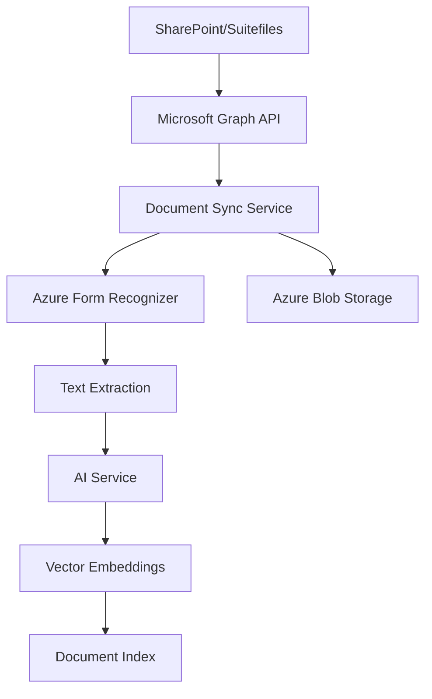
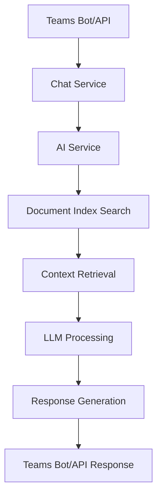

# DTCE AI Assistant - System Architecture

## Overview

The DTCE AI Assistant follows a modern, scalable architecture built on SOLID principles with clear separation of concerns. The system integrates Microsoft Teams, SharePoint, Azure services, and AI capabilities to provide comprehensive document analysis and project assistance.

## Architectural Principles

### SOLID Design Patterns

#### Single Responsibility Principle (SRP)
- **Document Sync Service**: Handles only SharePoint synchronization logic
- **AI Service**: Manages only AI/ML operations and inference
- **Microsoft Graph Client**: Responsible only for Graph API interactions
- **Azure Storage Client**: Handles only blob storage operations

#### Open/Closed Principle (OCP)
- **Service Layer**: Extensible through dependency injection without modifying core logic
- **Integration Layer**: New external services can be added without changing existing integrations
- **API Layer**: New endpoints extend functionality without modifying existing routes

#### Liskov Substitution Principle (LSP)
- **Abstract Base Classes**: All service interfaces can be substituted with implementations
- **Client Interfaces**: Graph client implementations are interchangeable
- **Storage Abstractions**: Different storage backends can be substituted seamlessly

#### Interface Segregation Principle (ISP)
- **Focused Interfaces**: Each service exposes only relevant methods
- **Client-Specific Contracts**: Teams bot uses only necessary service methods
- **Minimal Dependencies**: Components depend only on interfaces they actually use

#### Dependency Inversion Principle (DIP)
- **Service Dependencies**: High-level modules depend on abstractions, not concretions
- **Configuration Management**: Settings injected rather than hardcoded
- **External Services**: All external dependencies abstracted behind interfaces

## System Components

### Core Application Layer (`dtce_ai_bot/core/`)

```python
# app.py - FastAPI Application Bootstrap
- Application lifecycle management
- Middleware configuration
- Route registration
- Error handling setup
- CORS and security configuration

# dependencies.py - Dependency Injection Container
- Service instance management
- Configuration injection
- Client lifecycle management
- Scope management for requests

# middleware.py - Custom Middleware Stack
- Request/response logging
- Authentication middleware
- Error handling middleware
- Performance monitoring
```

### API Layer (`dtce_ai_bot/api/`)

```python
# documents.py - Document Management API
@router.post("/sync-suitefiles")           # Standard document sync
@router.post("/sync-suitefiles-async")     # Async sync with force option
@router.get("/search")                     # Document search functionality
@router.post("/extract")                   # Text extraction from documents

# chat.py - Conversational AI API
@router.post("/chat")                      # Document Q&A endpoint
@router.get("/chat/history")               # Conversation history
@router.post("/projects/scope")            # Project analysis endpoint
```

### Service Layer (`dtce_ai_bot/services/`)

#### Document Sync Service
```python
class DocumentSyncService:
    """
    Orchestrates SharePoint document synchronization with Azure Blob Storage.
    
    Responsibilities:
    - Coordinate document discovery and processing
    - Manage sync state and progress tracking
    - Handle force re-sync scenarios
    - Optimize performance through batching and caching
    """
    
    async def sync_documents(
        self, 
        graph_client: MicrosoftGraphClient,
        path: Optional[str] = None,
        force_resync: bool = False,
        progress_callback: Optional[Callable] = None
    ) -> DocumentSyncResult
```

#### AI Service
```python
class AIService:
    """
    Manages AI/ML operations for document analysis and Q&A.
    
    Responsibilities:
    - Document text processing and embedding generation
    - Question answering using retrieval-augmented generation
    - Project similarity analysis
    - Risk assessment and recommendations
    """
    
    async def answer_question(
        self,
        question: str,
        context_documents: List[Document]
    ) -> AIResponse
```

#### Chat Service
```python
class ChatService:
    """
    Handles conversation management and context maintenance.
    
    Responsibilities:
    - Conversation history management
    - Context window optimization
    - Multi-turn conversation support
    - Session state management
    """
    
    async def process_message(
        self,
        message: str,
        session_id: str,
        context: Optional[Dict] = None
    ) -> ChatResponse
```

### Integration Layer (`dtce_ai_bot/integrations/`)

#### Microsoft Graph Client
```python
class MicrosoftGraphClient:
    """
    Abstraction layer for Microsoft Graph API interactions.
    
    Features:
    - Automatic token refresh and management
    - Paginated request handling
    - Rate limiting and retry logic
    - SharePoint-specific operations
    """
    
    async def get_documents_by_path(
        self,
        path: str,
        recursive: bool = True
    ) -> AsyncIterator[Dict]
```

#### Azure Storage Client
```python
class AzureStorageClient:
    """
    Handles all Azure Blob Storage operations.
    
    Features:
    - Efficient large file uploads
    - Metadata management
    - Blob lifecycle management
    - Access control and security
    """
    
    async def upload_document(
        self,
        content: bytes,
        blob_name: str,
        metadata: Dict[str, str]
    ) -> BlobResult
```

#### Azure Form Recognizer
```python
class AzureFormRecognizer:
    """
    Document text extraction and analysis.
    
    Features:
    - PDF and image text extraction
    - Layout analysis and structure detection
    - Table and form recognition
    - Fallback to PyPDF2 for large files
    """
    
    async def extract_text(
        self,
        document_url: str,
        document_type: str
    ) -> ExtractionResult
```

### Teams Bot Layer (`dtce_ai_bot/bot/`)

```python
class TeamsBot(ActivityHandler):
    """
    Microsoft Teams bot implementation with comprehensive command support.
    
    Features:
    - Natural language message processing
    - Command recognition (Hi, Hello, Help)
    - Rich card responses
    - Proactive messaging support
    - Welcome message handling
    """
    
    async def on_message_activity(self, turn_context: TurnContext) -> None
    async def on_members_added_activity(self, members_added: List[ChannelAccount], turn_context: TurnContext) -> None
```

## Data Flow Architecture

### Document Synchronization Flow



### Query Processing Flow



## Security Architecture

### Authentication & Authorization
- **Microsoft Graph API**: OAuth 2.0 with client credentials flow
- **Azure Services**: Managed identity and service principal authentication
- **Teams Bot**: Bot Framework authentication
- **API Endpoints**: Optional JWT bearer token authentication

### Data Security
- **Encryption at Rest**: Azure Blob Storage encryption
- **Encryption in Transit**: HTTPS/TLS for all communications
- **Access Control**: Role-based access through Azure AD
- **Audit Logging**: Comprehensive request/response logging

## Scalability Considerations

### Horizontal Scaling
- **Stateless Services**: All services designed for horizontal scaling
- **Async Processing**: Non-blocking I/O for concurrent operations
- **Queue-based Processing**: Background job processing for large sync operations

### Performance Optimization
- **Caching Strategy**: Multi-level caching for frequently accessed documents
- **Batch Processing**: Efficient bulk operations for document processing
- **Connection Pooling**: Optimized connection management for external services

### Monitoring & Observability
- **Health Checks**: Comprehensive endpoint monitoring
- **Metrics Collection**: Performance and usage metrics
- **Distributed Tracing**: Request tracing across service boundaries
- **Error Tracking**: Centralized error logging and alerting

## Configuration Management

### Environment-based Configuration
```python
class Settings(BaseSettings):
    # Azure Storage Configuration
    azure_storage_account_name: str
    azure_storage_account_key: str
    azure_storage_container: str
    
    # Azure Form Recognizer Configuration
    azure_form_recognizer_endpoint: str
    azure_form_recognizer_key: str
    
    # Microsoft Graph Configuration
    azure_client_id: str
    azure_client_secret: str
    azure_tenant_id: str
    
    # SharePoint Configuration
    sharepoint_site_url: str
    
    class Config:
        env_file = ".env"
        case_sensitive = False
```

### Deployment Configurations
- **Development**: Local development with minimal external dependencies
- **Staging**: Full Azure integration for testing
- **Production**: Optimized configuration with security hardening

## Testing Strategy

### Unit Testing
- **Service Layer Tests**: Comprehensive testing of business logic
- **Integration Tests**: External service interaction testing
- **Mock Dependencies**: Clean isolation of units under test

### Integration Testing
- **API Endpoint Tests**: Full request/response cycle testing
- **Teams Bot Tests**: Bot framework integration testing
- **Azure Service Tests**: Cloud service integration validation

### Performance Testing
- **Load Testing**: API endpoint performance under load
- **Sync Performance**: Large document set synchronization testing
- **Memory Profiling**: Resource usage optimization testing

## Deployment Architecture

### Azure App Service Deployment
```yaml
# Azure deployment configuration
runtime: python-3.9
deployment:
  source: GitHub
  auto_deploy: true
  environment_variables:
    - AZURE_STORAGE_ACCOUNT_NAME
    - AZURE_CLIENT_ID
    - # ... other environment variables
```

### Teams App Deployment
```json
{
  "manifestVersion": "1.17",
  "version": "1.2.0",
  "bots": [{
    "botId": "...",
    "scopes": ["personal", "team", "groupChat"],
    "commandLists": [...]
  }]
}
```

## Future Architecture Considerations

### Planned Enhancements
- **Microservices Migration**: Breaking down monolith into focused microservices
- **Event-Driven Architecture**: Implementing event sourcing for audit trails
- **GraphQL API**: Flexible query interface for frontend applications
- **Multi-tenant Support**: Organization-level data isolation

### Technology Roadmap
- **Container Orchestration**: Docker and Kubernetes deployment
- **Serverless Functions**: Azure Functions for specific workloads
- **Advanced AI Integration**: Custom model training and fine-tuning
- **Real-time Collaboration**: WebSocket support for live document updates
